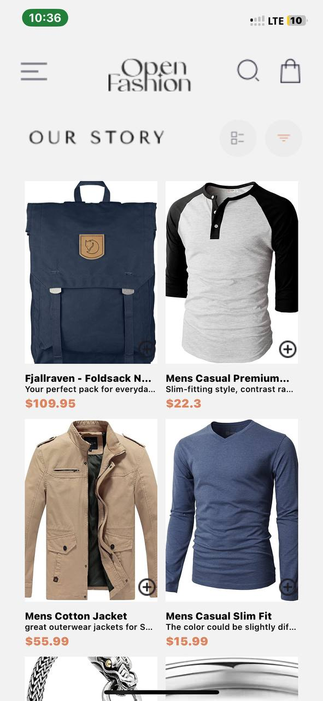

# Student ID- 11289423
# Overview
This project is a simple e-commerce mobile application built using React Native. It includes functionalities such as viewing product details, adding products to the cart, and navigating through different screens using a drawer navigator.

# Design Choices
React Navigation: Used for handling navigation between screens. The DrawerNavigator provides an intuitive way to navigate through the app.

AsyncStorage: Used for persistent storage of cart items. This ensures that the items added to the cart remain available even after the app is closed and reopened.

FlatList and ScrollView: Used for rendering lists of products and ensuring a smooth scrolling experience.
State Management: Used React's built-in hooks (useState and useEffect) for managing the state of products and cart items.

# Data Storage Implementation
AsyncStorage is used for storing and retrieving cart items.

Adding to Cart: When a user adds a product to the cart, the product is stored in AsyncStorage.

Fetching Cart Items: On the cart screen, items are fetched from AsyncStorage and displayed.

Removing from Cart: Users can remove items from the cart, and the updated list is saved back to AsyncStorage.

BELOW ARE SCREENSHOTS OF APP:

